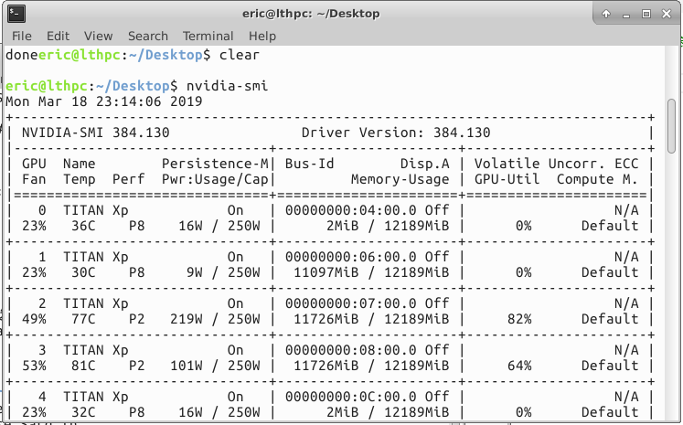
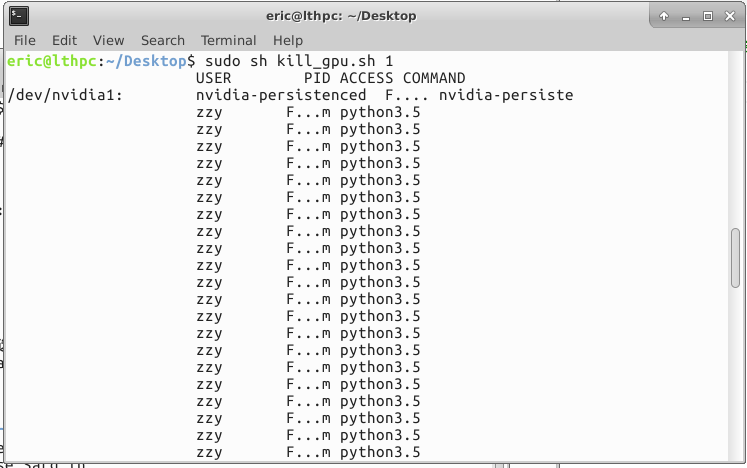

# kill_gpu
a shell script is used to free nvidia gpu memory

Note that given the card id, this script will kill all the pid that consuming gpu memory

# Example


input command line

```{r, engine='bash', count_lines}
sudo sh kill_gpu.sh 1
```
output

